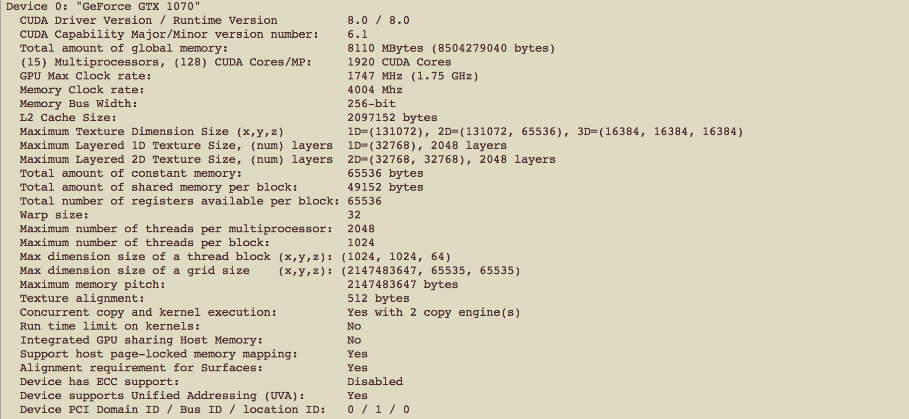

#HSLIDE

# C
"Wiesz kto wymyslił Pythona? Holendrzy, wiec jest taki lewacki - niby wszystko za Ciebie robi, a nic sie nie da w nim zrobic. 

A C? wiesz kto C wymyslil? Amerykanie! I to jest jezyk!"
- Piotr Tempczyk

#HSLIDE

## Główne różnice

- kompilowany, nie interpretowany
- bloki kodu oznaczone `{ }`, a nie wcięciami
- każda linijka kończy się średnikiem `;`
- silnie typowany
- samodzielne zarządzanie pamięcią - alokowanie i zwalnianie pamięci
- brak fancy struktur (słowniki, listy) - wszystko jest edytowane żywcem na pamięci

#HSLIDE

## Hello World
### C:
```
#include <stdio.h>
int main() {
	printf("Hello World!");
	return 0;
}
```
## python
```
print "Hello World!"
```

#HSLIDE

## Silnie typowany

**python**
```
def min(a, b):
	if a < b:
		return a
	return b
```

**C**
```
int min(int a, int b) {
	if(a < b) return a;
	return b;
}
float min(float a, float b) {
	//
}
long long min(long long a, long long b) {
	//
}
```

#HSLIDE

## Brak fancy struktur 1/2

**python**
```
T = xrange(100)
```

**C**
```
int *T;
T = malloc(100 * sizeof(int));
for (int i = 0; i < 100; i ++) {
	T[i] = i;
}
// Reszta kodu
// Na koniec
free(T)
```

#HSLIDE

## Brak fancy struktur 2/2

**python**
```
X = np.random.normal(size=(10, 10))
s = sum(map(sum, X)))
```

**C**
```
int T[10][10];
for(int i = 0; i < 10; i++)
	for(int j = 0; j < 10; j++)
		T[i][j] = rand();

int s = 0;
for(int i = 0; i < 10; i++)
	for(int j = 0; j < 10; j++)
		sum += T[i][j];
```

#HSLIDE

# CUDA

#HSLIDE

### Rozkład wątków


#HSLIDE

### Rozkład pamięci


#HSLIDE


#HSLIDE
## Kopiowanie i alokowanie danych na GPU i z GPU
```
float *gpuMemory;
cudaMalloc((void **)&gpuMemory, size);
float *hostMemory = (float *)malloc(size);
cudaMemcpy(gpuMemory, hostMemory, size, cudaMemcpyHostToDevice);
// odpalenie kernela
cudaMemcpy(hostMemory, gpuMemory, size, cudaMemcpyDeviceToHost);
cudaFree(gpuMemory);
free(hostMemory);
```

#HSLIDE
## Definiowanie i odpalanie kernela
```
__global__ void
vectorAdd(const float *A, const float *B, float *C, int numElements)
{
    //computation
}
```
```
vectorAdd<<<blocksPerGrid, threadsPerBlock>>>(d_A, d_B, d_C, numElements);
```
__global__ markuje funkcje, które są widoczne z GPU.

#HSLIDE
Pamiętajcie, żeby sprawdzać zawsze czy funkcje CUDY kończą się błędem:

```
cudaError_t err = cudaSuccess;
float *gpuMemory;
err = cudaMalloc((void **)&gpuMemory, size);
if (err != cudaSuccess) {
	fprintf(stderr, "Failed to allocate memory on GPU (error code %s).\n", cudaGetErrorString(err));
}
```

#HSLIDE
## Ćwiczenia 1/2
Dodawanie wektorów. Trzeba dokończyć skrypt ex1/vectorAdd.cu

Kompilowanie kodu odbywa się metodą `make`. Potraktujmy to narazie jako czarną skrzynkę bez wdawania się w szczegóły.

#HSLIDE
## Ćwiczenie 2/2
Mnożenie macierzy. Trzeba dokończyć skrypt ex2/matrixMul.cu.

Flagą `__shared__` oznaczamy dane, które są współdzielone w obrębie bloku.

Metoda `__syncthreads()` wywołuje barierę, która czeka aż wszystki wątki z bloku skończą pracę.

#HSLIDE

##Obrazek do ćwiczenia 2/2


